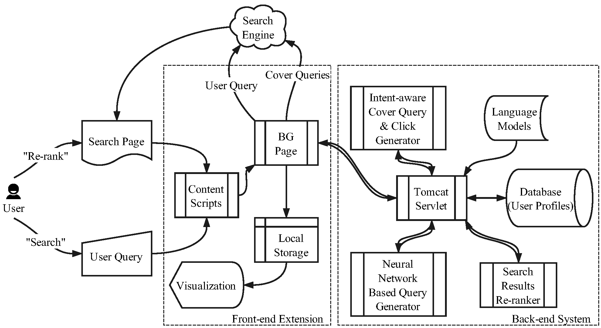

# Hide & Seek

We develop **Hide-n-Seek**, an intent-aware privacy protection plugin for personalized web search. 

In addition to users’ genuine search queries, Hide-n-Seek submits k cover queries and corresponding clicks to an external search engine to disguise a user’s search intent grounded and reinforced in a search session by mimicking the true query sequence. The cover queries are synthesized and randomly sampled from a topic hierarchy, where each node represents a coherent search topic estimated by both n-gram and neural language models constructed over crawled web documents. Hide-n-Seek also personalizes the returned search results by re-ranking them based on the genuine user profile developed and maintained on the client side. With a variety of graphical user interfaces, we present the topic-based query obfuscation mechanism to the end users for them to digest how their search privacy is protected. 

The core idea is documented in SIGIR '18 full paper "Intent-aware Query Obfuscation for Privacy Protection in Personalized Web Search" ([pdf](http://delivery.acm.org/10.1145/3210000/3209983/p285-ahmad.pdf)). Hide-and-Seek also has its own demo paper at SIGIR '18 called "Hide-n-Seek: An Intent-aware Privacy Protection Plugin for Personalized Web Search" ([pdf](http://delivery.acm.org/10.1145/3220000/3210180/p1333-yu.pdf)).

## How to run Hide & Seek?

Hide & Seek has **not** yet been published to chrome web store. Feel free to manually install the extension following such steps.

1. Download or fork project to your local environment. Click the green button `Clone or Download` in top-right corner of this page.
2. Open Chrome and go to `chrome://extensions`.
3. Click "load unpacked extension...".
4. Select the downloaded project folder.

and you're good to go!
